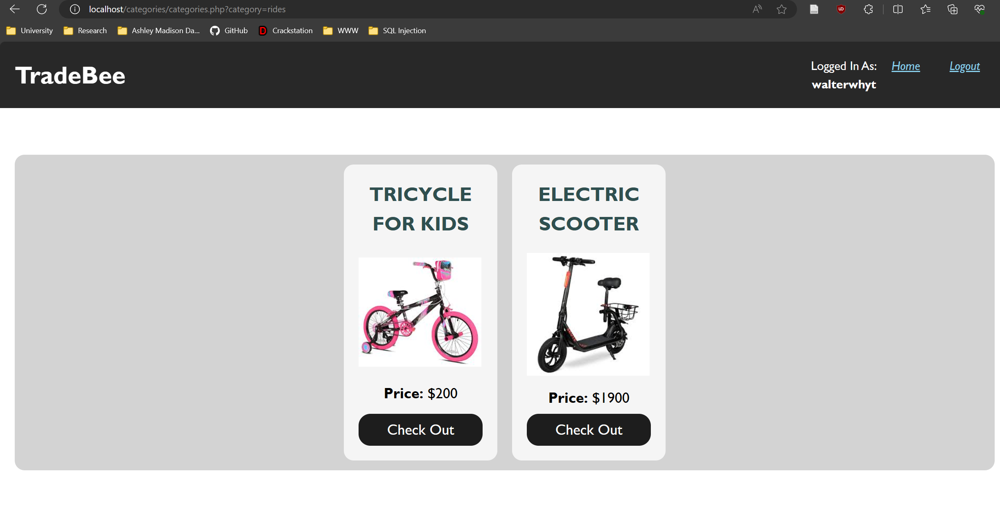

# Injection Flawed
This is a simple web application for trading products that has intentional SQL injection, XSS and CSRF flaws aimed at learning and providing demonstration to learn web application security. The app uses the lamp (Linux Apache MySQL PHP) stack for hosting, but you can also use XAMPP in windows for hosting it locally, to try it out.

***This project was used to demonstrate SQL injection flaws and provide mitigation techniques against those flaws for my coursework of the module: Security In Computing, in my second year of Islington College.***

## Installation
### Windows
* Install XAMPP
* Replace all the files in C:\\xampp\\htdocs with the files provided here.
* Start apache and mysql services in XAMPP control panel.
* Go to localhost/phpmyadmin, create a database called 'sql-injection' and import data.db file into the database. (The data.db file is located at database/data.db)
* Go to localhost to visit the web application.

### Ubuntu Server
* Setup the LAMP stack. (DigitalOcean is a great resource for this guide.)
* Install phpmyadmin
* Start the apache and mysql services.
* Go to localhost/phpmyadmin, create a database called 'sql-injection' amd import data.db file into the database. (The data.db file is located at database/data.db)
* Copy the files into var/www/
* Go to localhost to visit the web application.

## Screenshots
### Home Page

### Login Page

### CategoryFilter

### Offer Creation Page

